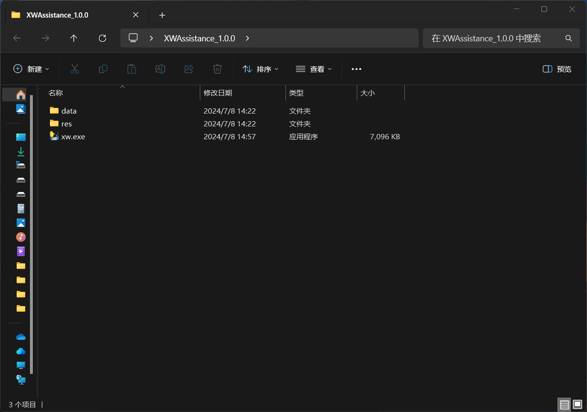
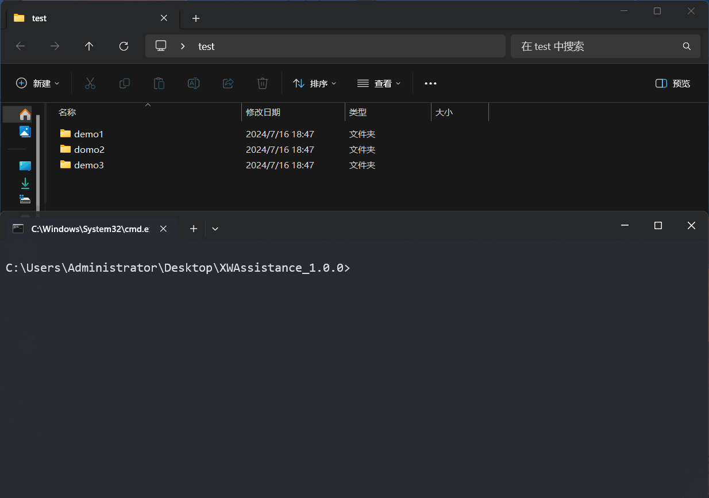

# 项目概述

**XWAssistance** 是一个命令行工具，旨在帮助用户管理和处理文件夹中的文件。它提供了多个命令，包括显示文件、格式化文件名、转换中文大写为阿拉伯数字等功能。

### 安装步骤

1. **下载项目文件**：
    - 下载最新的 `XWAssistance` 执行文件至本地计算机。

2. **配置环境变量**：(可选)
    - 将 `XWAssistance` 执行文件路径添加至系统的环境变量中，以便可以从任何位置访问该工具。

### **注意事项**

- 通过`环境变量`运行文件时需要使用`powershell`运行，用`cmd`会出现路径问题

### 命令列表

|     命令     |   参数    |        功能        |        开发进度         |
|:----------:|:-------:|:----------------:|:-------------------:|
|   `help`   |    无    |      显示所有命令      |      `Finish`       |
|   `show`   | `文件夹路径` |  显示指定文件夹下的所有文件   |      `Finish`       |
|  `format`  | `文件夹路径` |    匹配姓名后格式化命名    |      `Finish`       |
| `convert`  | `文件夹路径` |   将中文大写转换为拉伯数字   |      `Finish`       |
| `simplify` | `文件夹路径` |    简化单文件夹多层嵌套    |      `Finish`       |
|            |         |                  |                     |
|            |         | 一键导出未交名单 (接龙API) | `under development` |
|  `export`  | `保存路径`  | 一键导出文件链接 (接龙API) | `under development` |
|            |         |                  |                     |
|            |         |       考勤统计       | `under development` |
|            |         |     自动写旷课明细      | `under development` |
|            |         |      课堂回答统计      | `under development` |

### 示例

#### `help`命令

输入`xw help`，将显示所有可用命令及其简要说明。



#### `show`命令

显示指定文件夹下的所有文件。例如，要显示`/path/to/folder`下的文件，输入：

```bash
xw show /path/to/folder
```



#### `format`和`convert`命令

(姓名中有中文数字的慎用`convert`命令)\
这两个命令用于处理文件名或内容的转换。例如，要对`/path/to/folder`中的文件进行格式化或转换，输入：

```bash
格式化文件名
xw format /path/to/folder
转换中文大写为阿拉伯数字
xw convert /path/to/folder
```

请确保在使用`format`命令前已将格式化名单（`formated_names.txt`）放置在res目录中。


#### `simplify`命令

该命令用于简化具有相同名称的解压后的文件夹结构。例如：

```bash
xw simplify /path/to/folder
```


