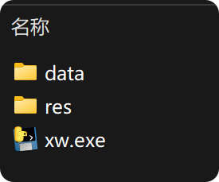
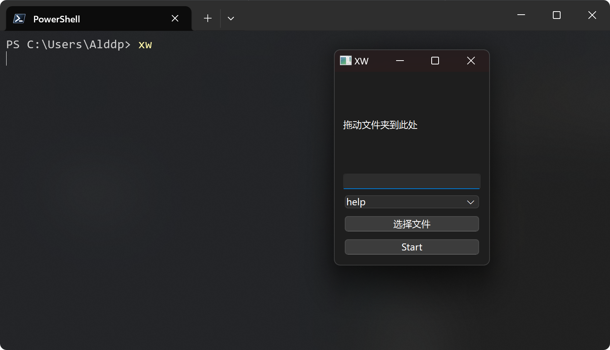

# XWAssistance   GUI简化版本

### 命令列表

|     命令     |   参数    |      功能       |
|:----------:|:-------:|:-------------:|
|   `help`   |    无    |    显示所有命令     |
|   `show`   | `文件夹路径` | 显示指定文件夹下的所有文件 |
|  `format`  | `文件夹路径` |  匹配姓名后格式化命名   |
| `convert`  | `文件夹路径` | 将中文大写转换为拉伯数字  |
| `simplify` | `文件夹路径` |  简化单文件夹多层嵌套   |

#### 使用方法:

1. 双击xw.exe

   

2. 将XWAssistance_2.0.0-simple路径加入环境变量，使用powershell运行

   